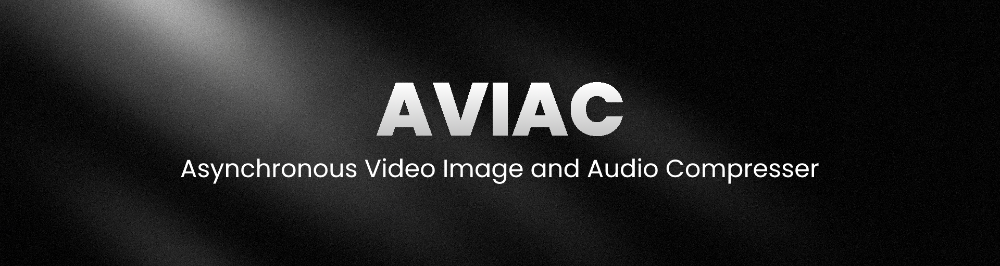

# AVIAC

An Asynchronous Video, Image and Audio Compresser that uses Sharp and FFmpeg to process your files in a Bun and Typescript server environment.

<p align="center">
    
</p>

It uses Sharp to compress images in memory with great quality and sub-second duration.
It leverages the performance of Bun processes to spawn FFmpeg and compress your audio and video files.

Unfortunatelly for most FFmpeg operations you must use temporary files. I couldn't find a workaround for this yet, but fortunatelly this doesn't increase server costs by much.

## Usage

### Image

If you want to turn any image into a **.webp** file use this.

```
const imageProcess = new ImageProcessor(file);
const result = await imageProcess.webp().execute();
```

### Video

If you want to turn any video into a **.webm** file use this.

```
const videoProcess = new VideoProcessor(file);
const webm = await videoProcess.webm().execute();
```

### Audio

If you want to turn any audio into a **.webm** file use this.

```
const audioProcess = new AudioProcessor(file);
const result = await audioProcess.webm().execute();
```

## Statistics

In this example I used downloaded sample media. Then compressed them to formats (WEBP and WEBM) that are super web and cloud friendly.

_These tests were produced on Windows 11, 16GB RAM in a Bun environment._

| Old File Type | Old File Size | New File Type | New File Size | Processing Time | Storage Saved |
| ------------- | ------------- | ------------- | ------------- | --------------- | ------------- |
| Image (png)   | 2,013 KB      | Image (webp)  | 421 KB        | 841 ms          | 79.09%        |
| Video (mp4)   | 367,336 KB    | Video (webm)  | 25,824 KB     | 10650 ms        | 92.96%        |
| Audio (wav)   | 23,556 KB     | Audio (webm)  | 1,891 KB      | 817 ms          | 91.97%        |

**These statistics show that it is often worth compressing the files as it can save a lot of space later on the cloud. These computing cost are usually negligable compared to storage costs your providers might charge.**
